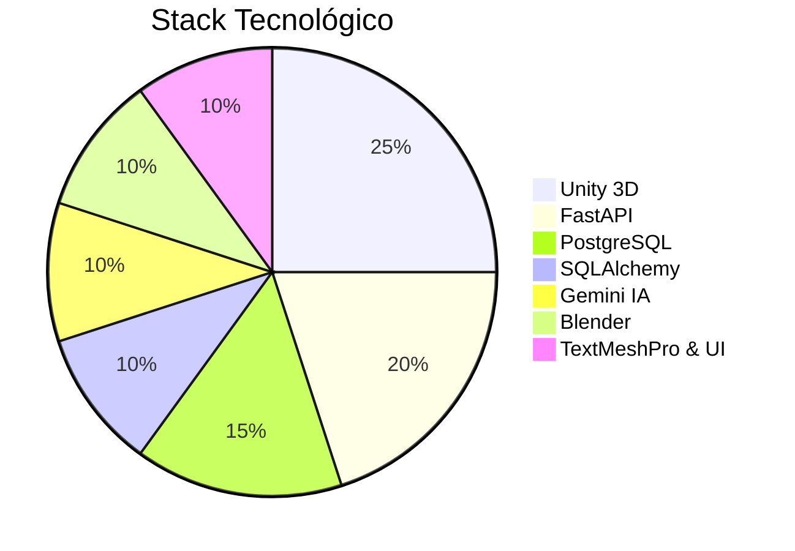
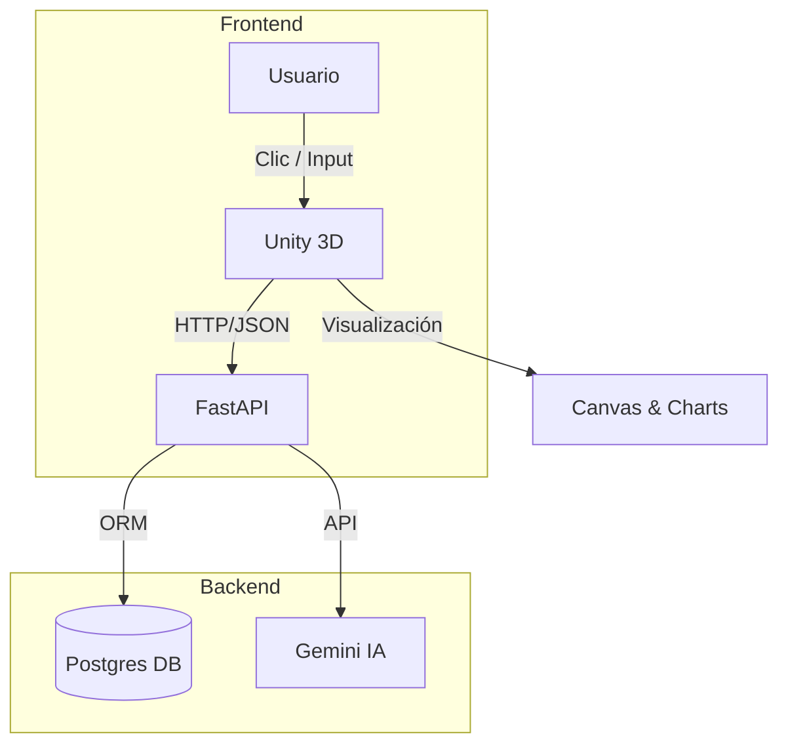

# HoloTwin USC – Rama Principal (main)


## 🌐 Descripción General

La rama principal (`main`) unifica **Frontend**, **Backend**, **Modelos 3D** y **Documentación** en un único repositorio listo para demostración académica:

* **Frontend**: Aplicación Unity 2024.x con interacción 3D y paneles dinámicos.
* **Backend**: API REST con FastAPI, autenticación JWT, conexión a Postgres y motor de IA Gemini.
* **Modelos 3D**: Artefactos Blender exportados a `.fbx` para Unity.
* **Docs**: Manuales, arquitecturas y guías en GitBook.

**Objetivo**: desplegar un gemelo digital funcional que simule y analice consumo energético en tiempo real, integrando IA y visualización inmersiva.

---

## 📂 Estructura del Repositorio

```plaintext
/ (root)
├── Frontend/               # Cliente Unity 3D
│   ├── Assets/             # Modelos, Scripts, Prefabs, UI
│   ├── ProjectSettings/    # Configuración Unity
│   └── README.md           # Documentación Frontend específica
├── src/backend/            # API FastAPI + servicios IA
│   ├── Controllers/        # Lógica de negocio y endpoints
│   ├── IA_scripts/         # Integración con Gemini API
│   ├── Models/             # SQLAlchemy + Pydantic
│   ├── Services/           # Repositorios y utilidades
│   ├── Utils/              # Configuración, helpers, CORS
│   ├── reportes/           # Exportadores PDF y plantillas
│   ├── routes/             # Definición de rutas
│   └── main.py             # Punto de arranque FastAPI
├── Models3D/               # Archivos .blend y .fbx originales
├── Docs/                   # GitBook: Manuales y arquitectura
├── .env                    # Variables de entorno sensibles
├── CHANGELOG.md            # Historial de cambios
├── README.md               # Este documento
└── .gitignore              # Archivos ignorados
```

---

## 📊 Tecnologías Clave



---

## 📈 Arquitectura del Sistema



* **Flujo**: Interacción → petición HTTP → procesamiento IA/DB → respuesta JSON → renderizado UI.

---

## 🚀 Despliegue Local

1. **Clonar repositorio principal**:

   ```bash
   ```

git clone [https://github.com/JhonHTipas21/HoloTwin---USC.git](https://github.com/JhonHTipas21/HoloTwin---USC.git)
cd HoloTwin---USC
git checkout main

````
2. **Backend**:
   ```bash
cd src/backend
python -m venv venv && source venv/bin/activate
pip install -r requirements.txt
# Configurar .env con DB_URL y JWT_SECRET
uvicorn main:app --reload --port 8000
````

3. **Frontend**:

   * Abre `Frontend/` en Unity Editor 2024.x
   * Instala paquetes: InputSystem, TextMeshPro
   * Ajusta `ApiService.BaseUrl` en `ApiService.cs`
   * Ejecuta `MainScene.unity`
4. **Modelos 3D**: Importa `.fbx` desde `Models3D/` en Unity si haces pruebas adicionales.

---

## 🔧 Contribución

1. Crea tu rama de feature:

   ```bash
   ```

git checkout -b feature/tu-feature

```
2. Realiza **commits** atómicos y descriptivos.
3. Abre un **Pull Request** contra `main` dando contexto de cambios.

---

## 📜 Licencia
MIT License © Universidad Santiago de Cali

> _"Innovación energética y visual unidas en cada línea de código."_

```
