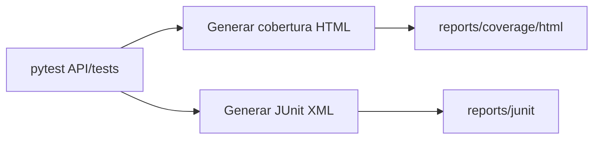

# 🧪 HoloTwin USC – Rama Tester (tester-branch)


## 📌 Propósito de la Rama

La rama `tester-branch` agrupa el **framework de pruebas** y **reportes de calidad** antes de integrar cambios en `main`:

* **Pruebas Unitarias & de Integración** para la API FastAPI.
* **Cobertura** y métricas de calidad.
* **Estructura mínima** para soporte de pipelines de QA.

---

## 📂 Estructura del Repositorio

```plaintext
/ (root)
├── API/
│   └── tests/                 # Pytest tests para backend
│       ├── __init__.py
│       ├── test_api.py        # Endpoints /auth, /consumo, /recomendaciones
│       ├── test_calculosdeenergia.py  # Lógica de cálculo y validaciones
│       ├── test_data_storage.py       # CRUD Postgres / SQLAlchemy
│       └── test_sensores.py           # Modelos y parsers de sensores
├── docs/
│   └── .gitkeep              # Estructura de documentación
├── src/
│   └── .gitkeep              # Código fuente opcional para pruebas locales
├── .gitignore                # Ignorar entornos y artefactos de tests
└── README.md                 # Documentación de esta rama (este archivo)
```

---

## 🛠 Cómo Ejecutar las Pruebas

### 1. Configurar entorno Python

```bash
# Desde la raíz del proyecto:
python -m venv venv && source venv/bin/activate
pip install -r src/backend/requirements-dev.txt
```

### 2. Ejecutar Pytest en `API/tests`

```bash
pytest API/tests/ \
  --maxfail=1 \
  --disable-warnings \
  --cov=src/backend \
  --cov-report=html:reports/coverage/html \
  --junitxml=reports/junit/results.xml
```

* **Cobertura**: abre `reports/coverage/html/index.html`
* **Resultados**: revisa `reports/junit/results.xml`

---

## 📊 Métricas y Reportes

* **Cobertura de prueba**: `reports/coverage/html/index.html`
* **Reporte JUnit**: `reports/junit/results.xml`



---

## 🔍 Estrategia de Pruebas

1. **Pruebas Unitarias**: cada función crítica debe tener al menos un test.
2. **Pruebas de Integración**: endpoints contra una base de datos de prueba.
3. **Mocks/Fixtures**: aislar llamadas externas (Gemini, servicios externos).
4. **Defensa de regresiones**: configurar `--maxfail=1` para detenerse en primer fallo.

---

## 🔧 Contribución

1. **Actualizar** o **agregar** tests en `API/tests/` para cada bug-fix o feature.
2. Confirmar **alta cobertura** (> 90%) en lógica crítica.
3. Ejecutar comandos de prueba y verificar reports antes de PR.

---

## 📜 Licencia

MIT License © Universidad Santiago de Cali

> *"La calidad nace de cada test escrito con intención."* 🏅
